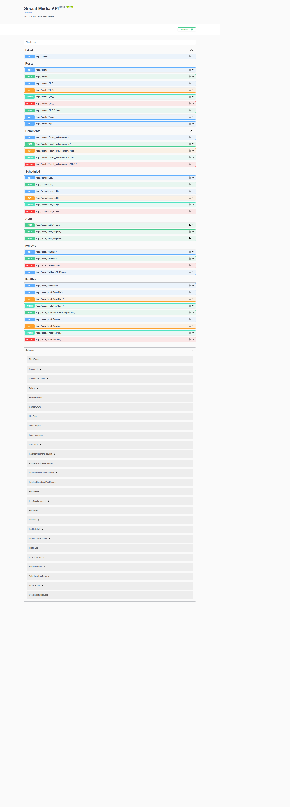
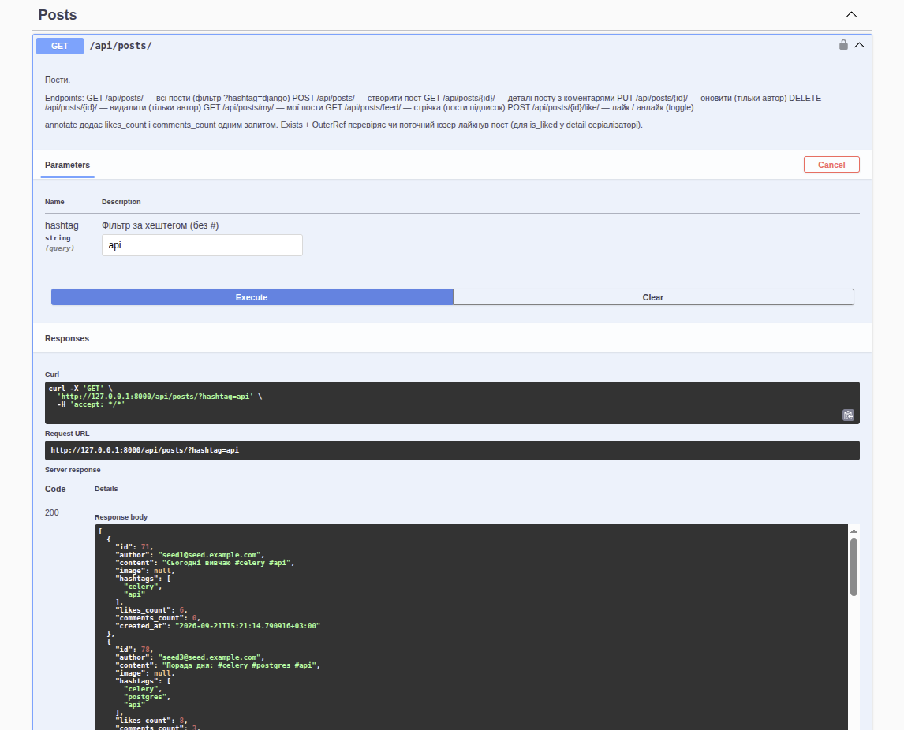
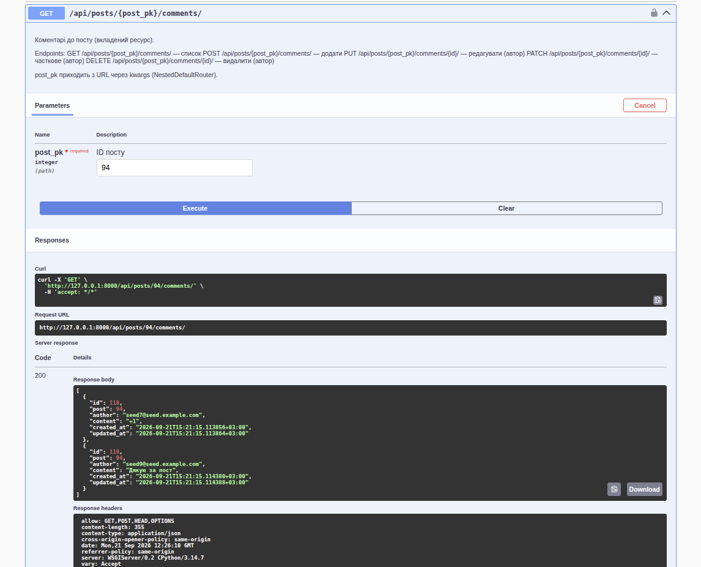
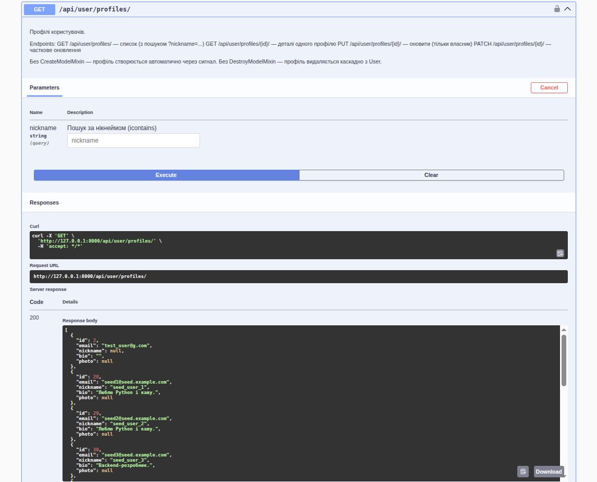

# Social Media API

**English** | [Українська](#українська-версія)

RESTful API for a social network built with Django REST framework: profiles, follows, posts with hashtags, likes, comments and scheduled posts (Celery).

## Stack

- Python 3.14, Django 6.1, Django REST framework
- PostgreSQL 17
- Celery + Redis (scheduled posts)
- Token authentication (`rest_framework.authtoken`)
- drf-spectacular (Swagger / ReDoc)
- Docker Compose

## Features

- Registration with email and password, login (get a token), logout (token is deleted)
- User profile: nickname, bio, date of birth, gender, photo; profile search by nickname
- Follows: follow / unfollow, my following list, my followers
- Posts with text and image; hashtags are extracted from the text automatically (`#django`)
- My posts, feed of followed users, filter by hashtag
- Likes (toggle), list of liked posts
- Comments on posts
- Scheduled posts: published by a Celery task at the chosen time
- Only the owner can update or delete their own posts, comments and profile

## Quick start (Docker)

```bash
cp .env.sample .env      # fill in SECRET_KEY and POSTGRES_PASSWORD
docker compose up --build
```

Services: `web` (API on port 8000), `db` (PostgreSQL), `redis`, `celery` (worker) and `celery-beat` (scheduler). Migrations are applied automatically when `web` starts.

Create an admin user:

```bash
docker compose exec web python manage.py createsuperuser
```

Stop: `docker compose down` (Postgres data and media files stay in volumes; `-v` removes them too).

## Running without Docker

PostgreSQL and Redis must be running (you can start only them with `docker compose up -d db redis`; the Redis port is not published to the host, so running Celery outside Docker requires your own Redis on `localhost:6379`).

```bash
python -m venv .venv
source .venv/bin/activate
pip install -r requirements.txt
cp .env.sample .env      # POSTGRES_HOST=localhost
python manage.py migrate
python manage.py runserver
```

Celery (in separate terminals):

```bash
celery -A social_media_api worker -l info
celery -A social_media_api beat -l info
```

## Seeding the database

The `seed_db` command creates users, profiles, follows, posts with hashtags, likes, comments and scheduled posts.

```bash
# in Docker
docker compose exec web python manage.py seed_db

# without Docker
python manage.py seed_db
```

Options:

| Option | Description |
|---|---|
| `--users N` | number of users (default 10) |
| `--posts N` | posts per user (default 3) |
| `--clear` | delete previously created seed data first |

Example: `python manage.py seed_db --clear --users 20 --posts 5`.

Seed users have emails `seed1@seed.example.com`, `seed2@seed.example.com`, ... and the password `password123`. Use `POST /api/user/auth/login/` to log in. `--clear` deletes only users with the `seed.example.com` domain; your own accounts are not touched.

## Environment variables (`.env`)

| Variable | Description |
|---|---|
| `SECRET_KEY` | Django secret key |
| `DEBUG` | `True` / `False` |
| `ALLOWED_HOSTS` | comma-separated hosts |
| `POSTGRES_DB`, `POSTGRES_USER`, `POSTGRES_PASSWORD` | database credentials (the `db` container uses the same values) |
| `POSTGRES_HOST`, `POSTGRES_PORT` | database address (`localhost` outside Docker; overridden to `db` in compose) |
| `CELERY_BROKER_URL`, `CELERY_RESULT_BACKEND` | Redis address (overridden to `redis` in compose) |

## API documentation

Once the project is running:

- Swagger UI: http://localhost:8000/api/doc/swagger/
- ReDoc: http://localhost:8000/api/doc/redoc/
- OpenAPI schema: http://localhost:8000/api/schema/

To authorize in Swagger: get a token via `POST /api/user/auth/login/`, click **Authorize** and enter `Token <your_token>`. All requests except registration and login require the `Authorization: Token <token>` header.

## Endpoints

**Auth** (`/api/user/auth/`)

| Method | URL | Description |
|---|---|---|
| POST | `register/` | register, returns a token |
| POST | `login/` | log in, returns a token |
| POST | `logout/` | deletes the token |

**Profiles** (`/api/user/profiles/`)

| Method | URL | Description |
|---|---|---|
| GET | `/` | list of profiles, search with `?nickname=` |
| GET | `{id}/` | user profile |
| PUT, PATCH | `{id}/` | update (owner only) |
| GET, PUT, PATCH, DELETE | `me/` | my profile |

**Follows** (`/api/user/follows/`)

| Method | URL | Description |
|---|---|---|
| GET | `/` | users I follow |
| POST | `/` | follow (`{"following": <user_id>}`) |
| DELETE | `{id}/` | unfollow |
| GET | `followers/` | my followers |

**Posts** (`/api/posts/`)

| Method | URL | Description |
|---|---|---|
| GET | `/` | all posts, filter with `?hashtag=django` |
| POST | `/` | create a post (`content`, `image`) |
| GET | `{id}/` | post with comments |
| PUT, PATCH, DELETE | `{id}/` | update / delete (author only) |
| GET | `my/` | my posts |
| GET | `feed/` | feed of followed users |
| POST | `{id}/like/` | like / unlike |

**Comments** (`/api/posts/{post_id}/comments/`)

| Method | URL | Description |
|---|---|---|
| GET, POST | `/` | list / add |
| PUT, PATCH, DELETE | `{id}/` | update / delete (author only) |

**Other**

| Method | URL | Description |
|---|---|---|
| GET | `/api/liked/` | posts I liked |
| GET, POST | `/api/scheduled/` | my scheduled posts / create |
| GET, PUT, PATCH, DELETE | `/api/scheduled/{id}/` | manage a scheduled post |

Scheduled post example (`publish_at` must be in the future, `hashtags` are comma-separated):

```json
{
  "content": "Hello from the future",
  "hashtags": "python,django",
  "publish_at": "2030-01-01T12:00:00Z"
}
```

Celery Beat runs the `publish_scheduled_posts` task every minute; it publishes all posts whose time has come.

## Tests

PostgreSQL must be running (`docker compose up -d db`):

```bash
python manage.py test
```

## Screenshots

### Swagger UI


### Posts list


### Post comments


### Profiles list


---

# Українська версія

[English](#social-media-api) | **Українська**

RESTful API соціальної мережі на Django REST framework: профілі, підписки, пости з хештегами, лайки, коментарі та відкладені пости (Celery). Скріншоти дивіться вище, у розділі **Screenshots**.

## Стек

- Python 3.14, Django 6.1, Django REST framework
- PostgreSQL 17
- Celery + Redis (відкладені пости)
- Token-автентифікація (`rest_framework.authtoken`)
- drf-spectacular (Swagger / ReDoc)
- Docker Compose

## Можливості

- Реєстрація за email і паролем, логін (отримання токена), логаут (видалення токена)
- Профіль користувача: нікнейм, біографія, дата народження, стать, фото; пошук профілів за нікнеймом
- Підписки: підписатися / відписатися, мої підписки, мої підписники
- Пости з текстом і зображенням; хештеги додаються автоматично з тексту (`#django`)
- Мої пости, стрічка підписок, фільтр за хештегом
- Лайки (toggle), список вподобаних постів
- Коментарі до постів
- Відкладені пости: публікуються Celery-таскою в задений час
- Оновлювати й видаляти можна лише власні пости, коментарі та профіль

## Швидкий старт (Docker)

```bash
cp .env.sample .env      # заповніть SECRET_KEY і POSTGRES_PASSWORD
docker compose up --build
```

Піднімаються сервіси: `web` (API на порту 8000), `db` (PostgreSQL), `redis`, `celery` (воркер) і `celery-beat` (планувальник). Міграції застосовуються автоматично при старті `web`.

Створити адміністратора:

```bash
docker compose exec web python manage.py createsuperuser
```

Зупинити: `docker compose down` (дані Postgres і медіафайли лишаються в томах; `-v` видалить і їх).

## Запуск без Docker

Потрібні запущені PostgreSQL і Redis (можна підняти лише їх: `docker compose up -d db redis`; порт Redis назовні не публікується, тож для Celery поза Docker потрібен власний Redis на `localhost:6379`).

```bash
python -m venv .venv
source .venv/bin/activate
pip install -r requirements.txt
cp .env.sample .env      # POSTGRES_HOST=localhost
python manage.py migrate
python manage.py runserver
```

Celery (в окремих терміналах):

```bash
celery -A social_media_api worker -l info
celery -A social_media_api beat -l info
```

## Наповнення бази тестовими даними

Команда `seed_db` створює користувачів, профілі, підписки, пости з хештегами, лайки, коментарі та відкладені пости.

```bash
# у Docker
docker compose exec web python manage.py seed_db

# без Docker
python manage.py seed_db
```

Параметри:

| Параметр | Опис |
|---|---|
| `--users N` | кількість користувачів (за замовчуванням 10) |
| `--posts N` | постів на користувача (за замовчуванням 3) |
| `--clear` | спершу видалити раніше створені seed-дані |

Приклад: `python manage.py seed_db --clear --users 20 --posts 5`.

Seed-користувачі мають email `seed1@seed.example.com`, `seed2@seed.example.com`, ... і пароль `password123`. Для входу використовуйте `POST /api/user/auth/login/`. Команда видаляє (`--clear`) лише користувачів із доменом `seed.example.com`, ваші власні акаунти вона не чіпає.

## Змінні середовища (`.env`)

| Змінна | Опис |
|---|---|
| `SECRET_KEY` | секретний ключ Django |
| `DEBUG` | `True` / `False` |
| `ALLOWED_HOSTS` | хости через кому |
| `POSTGRES_DB`, `POSTGRES_USER`, `POSTGRES_PASSWORD` | доступ до БД (ті самі значення використовує контейнер `db`) |
| `POSTGRES_HOST`, `POSTGRES_PORT` | адреса БД (`localhost` поза Docker; у compose підміняється на `db`) |
| `CELERY_BROKER_URL`, `CELERY_RESULT_BACKEND` | адреса Redis (у compose підміняється на `redis`) |

## Документація API

Після запуску:

- Swagger UI: http://localhost:8000/api/doc/swagger/
- ReDoc: http://localhost:8000/api/doc/redoc/
- OpenAPI-схема: http://localhost:8000/api/schema/

Для авторизації у Swagger: отримайте токен через `POST /api/user/auth/login/`, натисніть **Authorize** і введіть `Token <ваш_токен>`. Усі запити, крім реєстрації та логіну, вимагають заголовок `Authorization: Token <токен>`.

## Ендпоінти

**Auth** (`/api/user/auth/`)

| Метод | URL | Опис |
|---|---|---|
| POST | `register/` | реєстрація, повертає токен |
| POST | `login/` | логін, повертає токен |
| POST | `logout/` | видаляє токен |

**Профілі** (`/api/user/profiles/`)

| Метод | URL | Опис |
|---|---|---|
| GET | `/` | список профілів, пошук `?nickname=` |
| GET | `{id}/` | профіль користувача |
| PUT, PATCH | `{id}/` | оновити (лише власник) |
| GET, PUT, PATCH, DELETE | `me/` | мій профіль |

**Підписки** (`/api/user/follows/`)

| Метод | URL | Опис |
|---|---|---|
| GET | `/` | на кого я підписаний |
| POST | `/` | підписатися (`{"following": <user_id>}`) |
| DELETE | `{id}/` | відписатися |
| GET | `followers/` | мої підписники |

**Пости** (`/api/posts/`)

| Метод | URL | Опис |
|---|---|---|
| GET | `/` | усі пости, фільтр `?hashtag=django` |
| POST | `/` | створити пост (`content`, `image`) |
| GET | `{id}/` | пост з коментарями |
| PUT, PATCH, DELETE | `{id}/` | змінити / видалити (лише автор) |
| GET | `my/` | мої пости |
| GET | `feed/` | стрічка підписок |
| POST | `{id}/like/` | лайк / зняти лайк |

**Коментарі** (`/api/posts/{post_id}/comments/`)

| Метод | URL | Опис |
|---|---|---|
| GET, POST | `/` | список / додати |
| PUT, PATCH, DELETE | `{id}/` | змінити / видалити (лише автор) |

**Інше**

| Метод | URL | Опис |
|---|---|---|
| GET | `/api/liked/` | пости, які я вподобав |
| GET, POST | `/api/scheduled/` | мої відкладені пости / створити |
| GET, PUT, PATCH, DELETE | `/api/scheduled/{id}/` | керування відкладеним постом |

Приклад відкладеного посту (`publish_at` має бути в майбутньому, `hashtags` через кому):

```json
{
  "content": "Привіт із майбутнього",
  "hashtags": "python,django",
  "publish_at": "2030-01-01T12:00:00Z"
}
```

Celery Beat щохвилини запускає таску `publish_scheduled_posts`, яка публікує всі пости, чий час настав.

## Тести

Потрібен запущений PostgreSQL (`docker compose up -d db`):

```bash
python manage.py test
```
